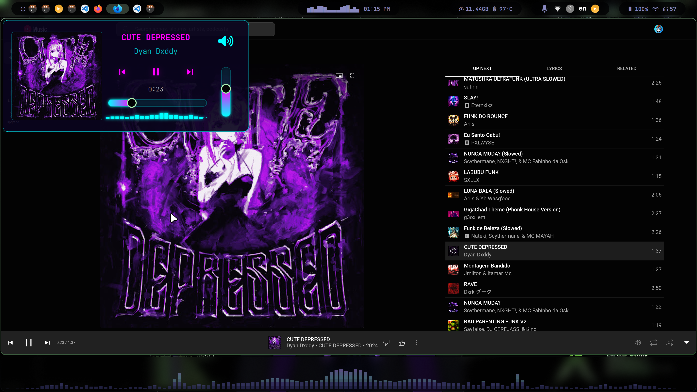

# Eww Music Widget

## Overview
A music widget for `eww` (Elkowars Wacky Widgets) that displays music information and provides playback controls with a Cyberpunk-inspired aesthetic.

## Features
- **Track Information**: Displays the current song title and artist.
- **Album Art**: Shows the album cover for the current track, with a fallback to a default image if no art is available.
- **Playback Controls**: Provides buttons for play/pause, next track, and previous track.
- **Progress Bar**: A seekable progress bar shows the current position and total duration of the track.
- **Volume Control**: Includes a vertical volume slider and a toggleable mute button.
- **Audio Visualizer**: Integrates a `cava` audio visualizer for a dynamic visual effect.
- **Cyberpunk Theme**: Styled with a neon-heavy, dark Cyberpunk theme.

## Dependencies
To use this widget, you need the following software installed:
- `eww`: The widget framework itself.
- `playerctl`: To control MPRIS-compatible music players.
- `pamixer`: For audio volume control (works with PulseAudio/PipeWire).
- `cava`: For the audio visualizer.
- `curl`: To fetch album art from URLs.
- **A Nerd Font**: Required for the icons used in the widget. The default configuration uses "JetBrains Mono Nerd Font".

## Demo




<!--  -->


## Installation

1.  **Install Dependencies**:
    - **On Arch Linux**:
      ```bash
      sudo pacman -S eww playerctl pamixer cava curl ttf-jetbrains-mono-nerd
      ```
    - **On Debian/Ubuntu**:
      ```bash
      sudo apt install playerctl libpam-dev cava curl fonts-jetbrains-mono
      # eww and pamixer may need to be installed manually if not in the official repositories.
      ```

2.  **Copy Widget Files**:
    Clone or copy this directory (`music-widget`) to your eww configuration path:
    `~/.config/eww/music-widget/`

3.  **Make Scripts Executable**:
    Navigate to the widget directory and grant execute permissions to the scripts:
    ```bash
    cd ~/.config/eww/music-widget
    chmod +x *.sh
    ```

4.  **Include the Widget**:
    Add the following line to your main `eww.yuck` file to include the widget's definitions:
    ```yuck
    (include "./music-widget/eww.yuck")
    ```

## Usage

1.  Ensure the `eww` daemon is running.

2.  To open the widget, run the following command:
    ```bash
    eww open music-widget
    ```
3.  To close it:
    ```bash
    eww close music-widget
    ```

4.  #### The best way to use it is to put a shortcut to toggle it:
    ```bash
    eww -c close music-widget --toggle
    ```

The widget will automatically display information from any active MPRIS-compatible player (e.g., Spotify,VLC,Firefox,Chrome).
